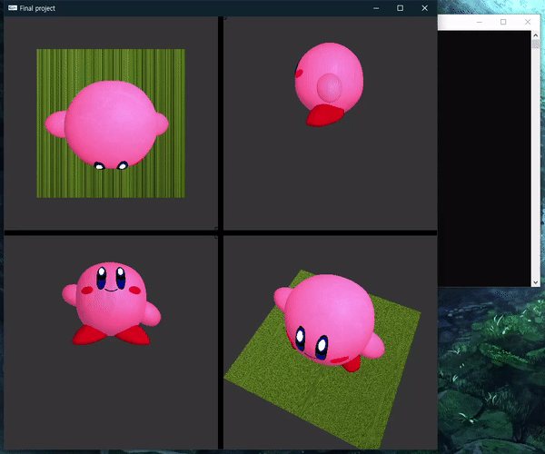

# Importing OBJ using OpenGL, C++

1학기 초 과제로 Autodesk 사의 3ds max 프로그램을 이용하여 3D 모델을 만들었습니다.

1학기 기말 프로젝트로 이때 만든 모델을 OpenGL 라이브러리를 이용하여 불러오고, 다음과 같은 기능을 제공하는 프로그램을 만들었습니다.

1. obj 파일 열기
2. 카메라 이동: 키보드 방향키(줌-인, 줌-아웃, 좌, 우)
3. 조명 설치
4. 색 반영
5. Texture 적용

**카메라 회전, 이미지 파일 읽기는 수업에서 제공된 소스를 활용했습니다.**

**프로젝트 실행에는 OpenGL 라이브러리가 필요합니다.**

 

# 구현
obj 파일에 색상 정보를 포함하는 방법, uv mapping 을 포함하는 방법을 찾을 수 없어 텍스트 파일로 수동 매핑하는 방식을 구현했습니다.

각 오브젝트 별로 클래스를 만들고 C++ STL 에서 제공하는 vector 자료구조에 삽입하여 관리했습니다.

위의 그림과 같이 각 오브젝트에 순서대로 색상을 입력해주었습니다.

obj 파일이 달라지면 color.txt, texture.txt 파일 또한 수정해줘야 하는 점이 아쉽습니다.

 

# 결과

## 로딩

## 카메라 이동, 회전

## 조명

## 색상

## 텍스쳐
